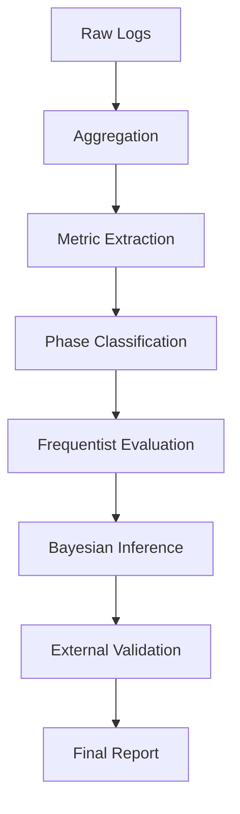

# ARENA — powered by AEME

> A reproducible evaluation engine to detect and quantify real improvements under uncertainty.

ARENA is a CLI-first evaluation framework built to answer a fundamental engineering question:

> Did the system truly improve — and by how much?

At its core lies **AEME (Aerial Evaluation & Measurement Engine)** —  
a statistical engine designed to validate improvement claims using reproducible, uncertainty-aware methods.

---

## What Is ARENA?

ARENA is not a data collector.  
It is not a dashboard.  

It is an **evaluation engine**.

It is built for environments where:

- Metrics fluctuate daily
- Noise masks real effects
- External factors distort results
- Proxy variables introduce bias

ARENA quantifies change rigorously and reproducibly.

---

## What Is AEME?

AEME (Aerial Evaluation & Measurement Engine) is the statistical core of ARENA.

It integrates:

- Frequentist testing (MWU, Bootstrap, GLM)
- Bayesian posterior inference (NumPyro / NUTS)
- Change-point detection
- Proxy endogeneity checks
- External dataset validation

AEME focuses on:

- Effect size
- Uncertainty bounds
- Robustness across models
- Reproducibility

ARENA is the orchestration layer.  
AEME is the analytical engine.

---

## Core Philosophy

ARENA is designed around four principles:

1. **Failure-first architecture**
   - Pipelines assume partial failure.
   - Validation precedes execution.

2. **Single source of truth**
   - All parameters are configuration-driven (`settings.toml`).

3. **Uncertainty-aware evaluation**
   - Outputs emphasize magnitude and confidence, not binary significance.

4. **Reproducible experimentation**
   - Improvements must survive re-analysis under multiple statistical assumptions.

---

## Architecture Overview



ARENA orchestrates the pipeline.  
AEME performs the evaluation.

---

## Installation

Python 3.11+ required.

```bash
pip install -e ".[dev]"
```

---

## Configuration

All runtime parameters are defined in `settings.toml`.

### Site Configuration

```toml
[site]
lat = 36.123456
lon = 140.123456
```

If left as `0.0`, `arena validate` will issue a warning.

### Quality Gates

```toml
[quality]
min_auc_n_used = 5000
min_minutes_covered = 1296
```

### Distance Bins

```toml
[distance_bins]
km = [0, 25, 50, 100, 150, 200]
```

---

## CLI Usage

ARENA is CLI-first.

### Validate configuration

```bash
arena validate
```

### Run full evaluation

```bash
arena run
```

### Dry run

```bash
arena run --dry-run
```

### Fetch external comparison data

```bash
arena fetch-opensky
```

Direct script execution is not supported.

---

## Statistical Methods

AEME integrates:

- Mann–Whitney U Test
- Bootstrap Confidence Intervals
- Negative Binomial GLM
- Bayesian Inference (NUTS)
- Change-Point Detection
- Proxy Bias Diagnostics

Outputs prioritize:

- Effect size
- Credible/confidence intervals
- Model robustness

---

## Use Cases

Originally developed for ADS-B receiver optimization, ARENA can generalize to:

- Sensor performance validation
- Infrastructure change evaluation
- Network observability experiments
- A/B testing with noisy metrics
- Any improvement verification problem

---

## Why This Exists

Improvement claims are cheap.  
Validated improvements are rare.  

ARENA exists to close that gap.

---

## License

MIT License

---

## Author

Yuki Murata  
Building systems that measure reality, not impressions.