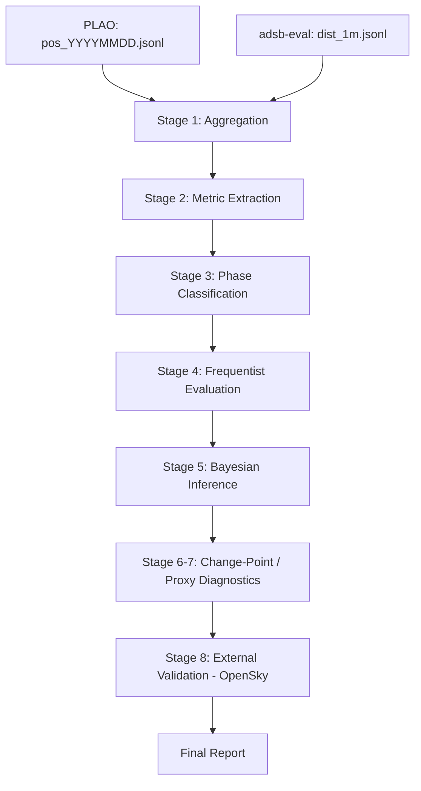

# ARENA — Aerial Radio Evaluation & Network Analytics

[](https://github.com/yukimurata0421/arena-eval-engine/actions/workflows/ci.yml)
[](https://www.python.org/)
[](./LICENSE)

> A reproducible evaluation engine to detect and quantify real improvements under uncertainty.

ARENA is a CLI-first statistical evaluation engine built to answer a fundamental engineering question:

> Did the system truly improve — and by how much?

At its core lies **AEME (Aerial Evaluation & Measurement Engine)**, a statistical framework that validates improvement claims using reproducible, uncertainty-aware methods.

ARENA is the orchestration layer.
AEME is the analytical engine.

---

## System Architecture

ARENA does **not** collect ADS-B data directly.

It analyzes datasets produced by two upstream systems running on Raspberry Pi.
Both upstream systems consume telemetry produced by `readsb`.

```
                    Raspberry Pi

                 readsb runtime
                    ├─ /run/readsb/aircraft.json
                    └─ /run/readsb/stats.json


        ┌───────────────┐        ┌───────────────┐
        │      PLAO     │        │   adsb-eval   │
        │ position log  │        │ runtime stats │
        └───────┬───────┘        └───────┬───────┘
                │                        │
                │ pos_YYYYMMDD.jsonl     │ dist_1m.jsonl
                │                        │
                └──────────────┬─────────┘
                               │
                               │ rsync
                               │ (script lives in PLAO repo)
                               │
                               ▼

                          ARENA (WSL2)
               statistical evaluation engine
```

| Component | Role | Repository |
|-----------|------|------------|
| **PLAO**  | Raw aircraft position logger (append-only JSONL) | [plao-pos-collector](https://github.com/yukimurata0421/plao-pos-collector) |
| **adsb-eval** | Lightweight runtime telemetry/statistics layer (generates `dist_1m.jsonl` among other outputs) | [adsb-eval](https://github.com/yukimurata0421/adsb-eval) |
| **ARENA** | Statistical evaluation engine (this repository) | — |

---

## Required Inputs

ARENA relies on two upstream datasets produced on Raspberry Pi.

### PLAO position logs

Produced by [PLAO](https://github.com/yukimurata0421/plao-pos-collector).

| | |
|---|---|
| **Input** | `/run/readsb/aircraft.json` |
| **Output** | `pos_YYYYMMDD.jsonl` |

This dataset records aircraft positions as append-only JSONL logs.
Each row contains decoded ADS-B position information.

### adsb-eval telemetry metrics

Produced by [adsb-eval](https://github.com/yukimurata0421/adsb-eval).

adsb-eval performs lightweight runtime telemetry/statistics processing and generates multiple JSONL outputs derived from receiver telemetry.

Among these outputs, **ARENA consumes `dist_1m.jsonl`** as one of its primary datasets.

Primary logger for this handoff:

| Logger | Input | Output |
|--------|-------|--------|
| `adsb_dist_logger.py` | `/run/readsb/aircraft.json` | `dist_1m.jsonl`, `dist_1m_errors.jsonl` |

---

## Data Transfer

Data transfer from Raspberry Pi to the ARENA analysis environment is handled via `rsync`.

The transfer script is implemented in the [PLAO repository](https://github.com/yukimurata0421/plao-pos-collector) (`ops/sync/`), but synchronizes outputs from both upstream systems.

Typical transferred files include:

- `pos_YYYYMMDD.jsonl` from PLAO
- `dist_1m.jsonl` from adsb-eval

Example destination paths on WSL2:

```text
/mnt/e/arena/data/plao_pos/pos_*.jsonl
/mnt/e/arena/data/dist_1m.jsonl
```

---

## Evaluation Pipeline

ARENA orchestrates a multi-stage evaluation pipeline.



Inputs to the pipeline:

- `pos_YYYYMMDD.jsonl` from PLAO
- `dist_1m.jsonl` from adsb-eval

---

## CLI Usage

ARENA is CLI-first.

### Validate configuration

```bash
arena validate
```

### Run full evaluation

```bash
arena run
```

### Dry run

```bash
arena run --dry-run
```

### Fetch external comparison data

```bash
arena fetch-opensky
```

Direct script execution is not supported.

---

## Configuration

All runtime parameters are defined in `settings.toml`.

### Site configuration

```toml
[site]
lat = 36.123456
lon = 140.123456
```

If left as `0.0`, `arena validate` will issue a warning.

### Quality gates

```toml
[quality]
min_auc_n_used = 5000
min_minutes_covered = 1296
```

### Distance bins

```toml
[distance_bins]
km = [0, 25, 50, 100, 150, 200]
```

---

## Minimal Local Reproduction

```bash
pip install -e ".[dev]"
arena validate
pytest -q
```

> **Note**
> `arena validate` and `pytest` operate on sample datasets located in `data/sample/`.
> Running a full evaluation with `arena run` requires real datasets generated by PLAO and adsb-eval.

---

## Installation

Python 3.11+ is required.

```bash
pip install -e ".[dev]"
```

---

## Test Execution

Normal run (fast / CI):

```bash
pytest -q
```

Diagnose slow tests:

```bash
pytest -q --durations=20
```

Verbose with timings:

```bash
pytest -vv --durations=20
```

`--durations` is for diagnostics and is not enabled by default to avoid noisy CI logs.

---

## Docker (CPU-only)

Build:

```bash
docker build -f docker/Dockerfile.cpu -t arena-cpu .
```

Run:

```bash
docker run --rm arena-cpu
```

---

## Development: pre-commit (recommended)

To prevent CI failures, run the same checks locally before every commit.

1. Install dev dependencies:

   ```bash
   pip install -e ".[dev]"
   ```

2. Install git hooks:

   ```bash
   pre-commit install
   ```

3. (Optional) Run once against all files:

   ```bash
   pre-commit run --all-files
   ```

After this, `ruff check` and `ruff format` (and basic TOML/YAML sanity checks) will run automatically on `git commit`.

---

## Public Data Policy

This public repository keeps reproducible samples only under:

- `data/sample/`
- `output/sample/`

Large experimental raw data and full output artifacts are intentionally excluded from version control.

To (re)create samples from local private datasets:

```bash
python scripts/tools/create_public_samples.py
```

---

## Documentation

For more details, see:

- [AEME — statistical methods and design philosophy](docs/aeme.md)

---

## Repository Layout

| Directory | Description |
|-----------|-------------|
| `src/arena/` | Core CLI, pipeline engine, and shared library code |
| `scripts/` | Analysis utilities used by pipeline stages |
| `tests/` | Lightweight CI validation |
| `data/sample/` | Minimal datasets for CI and structural validation |
| `output/sample/` | Example output directory structure |
| `docs/` | Design notes and supplementary documentation |

---

## Related Repositories

| Repository | Role |
|------------|------|
| [plao-pos-collector](https://github.com/yukimurata0421/plao-pos-collector) | Upstream raw position logger |
| [adsb-eval](https://github.com/yukimurata0421/adsb-eval) | Upstream runtime telemetry/statistics generator |

---

## Why This Exists

Improvement claims are cheap.
Validated improvements are rare.

ARENA exists to close that gap.

---

## License

MIT License

---

## Author

Yuki Murata
Building systems that measure reality, not impressions.