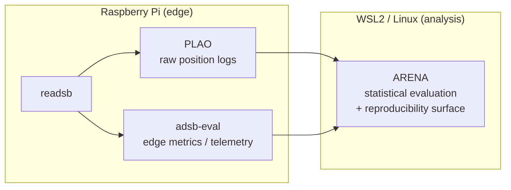

[](https://github.com/yukimurata0421/arena-eval-engine/actions/workflows/verify-smoke.yml)
[](https://github.com/yukimurata0421/arena-eval-engine)
[](https://github.com/yukimurata0421/arena-eval-engine/blob/main/README.md#version-and-release-status)

# ARENA Public Release

ARENA is a reproducible evaluation and artifact pipeline for ADS-B research workflows, with deterministic public smoke verification for the release layer.
This repository intentionally separates research/statistical evaluation concerns from public release-layer reproducibility concerns.

## Version and Release Status

- Current source version in this repository: `0.2.9`.
- See GitHub Releases for published release notes and tagged versions.

## Where ARENA Fits

ARENA is the statistical evaluation and public reproducibility layer within a broader ADS-B telemetry stack.

- **PLAO** handles raw aircraft position logging.
- **adsb-eval** handles edge-side metrics and telemetry summaries.
- **ARENA** consumes those upstream outputs for evaluation, comparison, and reproducible public-release verification.

The diagram below shows this relationship at a high level.


```mermaid
flowchart LR
  subgraph EDGE["Raspberry Pi (edge)"]
    R["readsb"]
    P["PLAO<br/>raw position logs"]
    E["adsb-eval<br/>edge metrics / telemetry"]
    R --> P
    R --> E
  end

  subgraph ANALYSIS["WSL2 / Linux (analysis)"]
    A["ARENA<br/>statistical evaluation<br/>+ reproducibility surface"]
  end

  P --> A
  E --> A
```

For broader stack context, see [docs/system-context.md](docs/system-context.md).  
For repository-internal responsibility boundaries, see [docs/architecture.md](docs/architecture.md).

## Highlights
- 8-stage pipeline (`arena.pipeline`) for aggregation, evaluation, reporting, and comparisons.
- Failure-resilient execution model: stage-level continuation and explicit error reporting.
- Append-only JSONL execution logging (`output/performance/pipeline_runs.jsonl`) for auditability.
- `PipelineBuildOptions` for environment-separated pipeline construction (feature toggles and optional stages).
- CLI-first operation (`python -m arena.cli ...`) with deterministic path/env resolution.

## Documentation Map
- [Architecture](docs/architecture.md): public release-layer responsibility boundaries
- [System Context](docs/system-context.md): where ARENA fits in the broader ADS-B telemetry stack
- [Reproducibility](docs/reproducibility.md): release-layer reproducibility contract
- [Artifact Design](docs/artifact-design.md): why the artifact control layer exists
- [Failure Taxonomy](docs/failure-taxonomy.md): failure visibility and non-silent failure structure
- [AI-Assisted Analysis](docs/ai-assisted-analysis.md): how AI is used and what is not trusted automatically
- [AEME](docs/aeme.md): evaluation-method and analysis-core design

## Repository Layout
- `src/arena/`: core CLI, pipeline, and shared runtime modules.
- `scripts/`: stage implementation scripts and compatibility shims.
- `tests/`: pytest-based contract and regression tests.

## Quick Start
```bash
python -m venv .venv
source .venv/bin/activate  # PowerShell: .\.venv\Scripts\Activate.ps1
pip install -U pip
pip install -e .[dev]
```

## Public Smoke Reproducibility (Release Layer)
This repository includes a **public smoke sample** for **release-layer reproducibility**.

Use this when you need deterministic checks of:
- command execution
- release-layer flow
- artifact generation
- output verification

First command (build sample fixture):
```bash
python scripts/tools/sample_data/build_public_sample.py --force
```
Expected output includes:
- `[OK] sample_root: ...\sample_data\smoke`
- `[OK] manifest: ...\sample_data\smoke\manifest.json`

Then freeze and verify:
```bash
python scripts/tools/sample_data/freeze_expected_outputs.py --force
python scripts/tools/sample_data/verify_sample_outputs.py
```
Expected verify result:
- `[SUMMARY] matched=... missing=0 unexpected=0 different=0`

Scope note:
- This smoke sample is for artifact/release-layer reproducibility.
- This is **not** research/statistical reproducibility of real ADS-B findings.
- For details, see `docs/reproducibility.md`.

## GitHub Actions Workflows
- `verify-smoke` (`.github/workflows/verify-smoke.yml`):
  lightweight deterministic smoke verification for the release layer (push/PR/manual).
  It builds a synthetic smoke sample in CI temp storage and verifies it against repo-fixed expected outputs (`sample_data/smoke/expected`).
  The verify step reads repo-fixed expected outputs under `sample_data/smoke/expected`.
  It intentionally does not run `freeze_expected_outputs.py` in CI.
- `artifacts-verify-replay` (`.github/workflows/artifacts-verify-replay.yml`):
  manual heavier audit/revalidation path (`workflow_dispatch` only).
  It generates a deterministic artifact bundle, runs `artifacts verify` and `artifacts replay`, then uploads logs/bundle outputs.

These workflows validate release-layer reproducibility claims.
They do not claim research/statistical reproducibility.

## Environment Setup
Use one of the following setup levels:

1. Test/validation setup (minimum public baseline):
```bash
pip install -e .[dev]
```
2. Full Stage 1-8 runtime setup (adds Stage 4/5 probabilistic stack):
```bash
pip install -e .[dev]
pip install "jax>=0.4.30" "jaxlib>=0.4.30" "numpyro>=0.15.0" "pymc>=5.0.0" "arviz>=0.17.0"
```

Sanity checks:
```bash
python -m arena.cli --help
python -m arena.cli validate
pytest
coverage run -m pytest -q && coverage report -m
```

## Windows / WSL Quick Setup
Windows PowerShell (minimum public baseline):
```powershell
py -3 -m venv .venv
.\.venv\Scripts\Activate.ps1
python -m pip install -U pip
pip install -e .[dev]
python -m arena.cli --help
python -m arena.cli validate
pytest
```

WSL (Ubuntu, full Stage 1-8 runtime):
```bash
python3 -m venv .venv
source .venv/bin/activate
python -m pip install -U pip
pip install -e .[dev]
pip install "jax>=0.4.30" "jaxlib>=0.4.30" "numpyro>=0.15.0" "pymc>=5.0.0" "arviz>=0.17.0"
python -m arena.cli --help
python -m arena.cli validate
pytest
coverage run -m pytest -q && coverage report -m
```

## Runtime Environment Variables
Set these when running outside defaults:
- `ARENA_SCRIPTS_ROOT`
- `ARENA_DATA_DIR`
- `ARENA_OUTPUT_DIR`
- `ARENA_SETTINGS`
- `ARENA_PHASE_CONFIG`

OpenSky integration credentials (optional, only when fetching traffic data):
- `OPENSKY_CLIENT_ID`
- `OPENSKY_CLIENT_SECRET`

## CLI Examples
```bash
python -m arena.cli --help
python -m arena.cli validate
python -m arena.cli run --only 1 --no-gpu
```

Optional overrides:
```bash
python -m arena.cli run --only 1 --no-gpu \
  --data-dir ./data \
  --output-dir ./output \
  --settings ./scripts/config/settings.toml
```

## Testing
```bash
pytest
coverage erase
coverage run --rcfile=.coveragerc -m pytest -q
coverage report --rcfile=.coveragerc -m
```
`pytest` already includes coverage options from `pyproject.toml` (`--cov-config=.coveragerc --cov=src/arena --cov=scripts`).
`pytest` is configured through `pytest.ini` to run with fixed coverage boundaries (`--cov=src/arena --cov=scripts --cov-config=.coveragerc`).

Import boundary check (optional, useful when multiple local clones exist):
```bash
python - <<'PY'
import arena, arena.artifacts
print("arena.__file__ =", arena.__file__)
print("arena.artifacts.__file__ =", arena.artifacts.__file__)
PY
```
Both paths should resolve under this repository tree when running tests for this release layer.

## Docker
```bash
docker compose -f docker/docker-compose.yml run --rm arena-tests
docker compose -f docker/docker-compose.yml run --rm arena-validate
```

Real-data Stage 1 / full pipeline execution (opt-in) is documented in `docs/real-data-smoke.md`.
It uses host-mounted paths and keeps private data/credentials outside this repository.

## Clean Public ZIP
Build a distribution zip that excludes VCS/caches/build artifacts:
```bash
python scripts/tools/build_public_zip.py --output arena_public_source.zip
```
The generated zip excludes at least:
- `.git/`
- `__pycache__/`
- `*.pyc`
- `.pytest_cache/`
- `*.egg-info/`
- `.coverage`
- `htmlcov/`
- `build/`
- `dist/`
- `output/`
- `scripts/tools/debug/tmp_*`
- `scripts/structure`

## Notes for Public Usage
- Secrets, credential files, and private runtime artifacts are intentionally excluded.
- Absolute local paths are not required; use environment variables or repo-relative defaults.
- Generated data/log/output directories are not part of this release baseline.
- `scripts/tools/debug/` contains developer diagnostics; `tmp_*` debug helpers are excluded from public zip artifacts.
