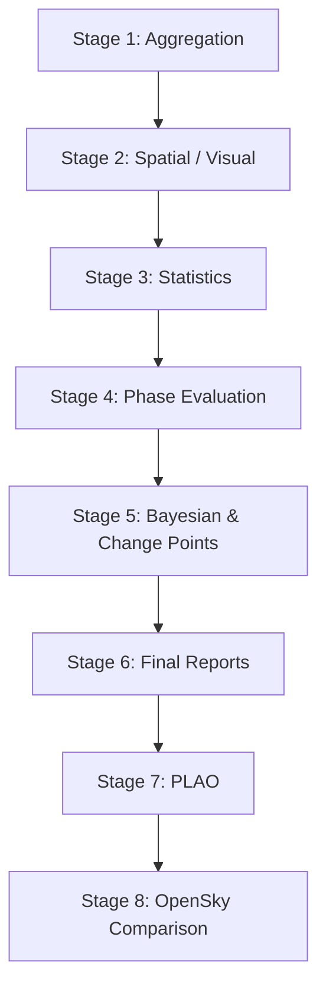

# Architecture

ARENA is the statistical evaluation layer in a three-repository telemetry stack.
It does not collect data or decode ADS-B signals. It evaluates telemetry produced by upstream systems.

## System Context

```
Raspberry Pi (edge)                    WSL2 / Linux (analysis)
┌─────────────────────┐                ┌──────────────────────────┐
│  readsb runtime     │                │         ARENA            │
│  ├─ aircraft.json   │                │                          │
│  └─ stats.json      │                │  src/arena/              │
│                     │                │  ├─ pipeline/   8 stages │
│  PLAO               │  rsync/pull    │  ├─ artifacts/  verify   │
│  └─ pos_*.jsonl ────┼───────────────>│  ├─ lib/        config   │
│                     │                │  └─ cli.py      entry    │
│  adsb-eval          │                │                          │
│  └─ dist_1m.jsonl ──┼───────────────>│  scripts/                │
│                     │                │  └─ adsb/analysis/       │
└─────────────────────┘                └──────────────────────────┘
```

Heavy computation runs on the analysis machine, not on the edge.
The Raspberry Pi must maintain headroom to function as a reliable observation instrument.
This is not a resource constraint workaround — there is no reason to process statistics at the edge.

Repositories:

- [PLAO](https://github.com/yukimurata0421/plao-pos-collector) — per-aircraft position logging on the Pi
- [adsb-eval](https://github.com/yukimurata0421/adsb-eval) — minute-level distance and signal aggregation on the Pi
- **ARENA** (this repository) — statistical evaluation on WSL2/Linux

## Pipeline Stages

All stages are orchestrated by `arena run` and emit artifacts into `output/`.



| Stage | Name | Key Scripts | Primary Outputs |
|---|---|---|---|
| 1 | Aggregation | `adsb_aggregator.py`, `adsb_eval_pk_aggregator.py`, `signal_stats_aggregator.py` | `adsb_daily_summary_v2.csv`, signal summaries |
| 2 | Spatial / Visual | `adsb_daily_heatmap.py`, `adsb_polar_coverage_evaluator.py` | Heatmap HTML, coverage trend CSV |
| 3 | Statistics (CPU) | `adsb_baseline_nb_eval.py`, `adsb_distance_binomial_eval.py`, `adsb_stats_eval.py` | NB-GLM results, distance-bin comparisons |
| 4 | Phase Evaluation | `adsb_phase_evaluator_v3.py` (Dual-Baseline NumPyro NUTS) | Phase evaluator report, Bayesian results CSV |
| 5 | Bayesian & CP | `adsb_bayesian_dynamic_eval.py`, `adsb_detect_change_point.py` | Change-point reports, posterior summaries |
| 6 | Final Reports | `adsb_total_performance_reporter.py`, `adsb_vertical_profile_evaluator.py` | Consolidated report, LOS efficiency trend |
| 7 | PLAO | `plao_distance_auc_eval.py` | PLAO AUC summary (independent data source) |
| 8 | OpenSky Compare | `adsb_opensky_comparison_eval.py` | OpenSky vs local reception comparison |

Stages execute in dependency order. Each stage continues on failure and records the failure reason in `pipeline_runs.jsonl`.

## Package Structure

```
src/arena/
├── pipeline/           # Orchestration (7 modules)
│   ├── entrypoint.py   # Top-level run flow
│   ├── stages.py       # Step definitions and expected outputs
│   ├── runner.py       # Execution, timeout, skip, output validation
│   ├── decision.py     # Skip-existing logic with dependency tracking
│   ├── backend.py      # Native / WSL backend resolution
│   ├── record_io.py    # Append-only JSONL audit logging
│   └── error_policy.py # Failure classification and recommended actions
│
├── artifacts/          # Research artifact substrate (14 modules)
│   ├── integrity.py    # Bundle verification (hash, schema, provenance)
│   ├── replay.py       # Bundle-level revalidation and audit replay
│   ├── manifest.py     # Manifest record generation
│   ├── policies.py     # Required/recommended targets, exclusion rules
│   ├── schema.py       # JSON Schema validation for all bundle outputs
│   ├── selection.py    # Ordered target list from required/recommended/candidate
│   ├── discovery.py    # Source path resolution and glob fallbacks
│   └── ...             # hash_utils, lineage, provenance, models, etc.
│
├── lib/                # Shared infrastructure
│   ├── paths.py        # Injectable path resolution (scripts, output, data roots)
│   ├── settings_loader.py  # TOML settings discovery and loading
│   ├── phase_config.py     # Phase definition loading with cache/reload
│   ├── runtime_config.py   # Runtime settings helper
│   ├── nb2_models.py       # Shared NegativeBinomial2 model definitions
│   └── stats_utils.py      # Common statistical utilities
│
└── cli.py              # Entry point: run, validate, fetch-opensky, artifacts verify/replay
```

## Artifact Subsystem

The artifact subsystem turns pipeline outputs into verifiable, reproducible bundles.
It was extracted from `merge_output_for_ai.py` and promoted to `src/arena/artifacts/`.

Lifecycle: discovery → selection → manifest → packaging → documentation → integrity.

Backward compatibility is maintained through `sys.modules` aliasing in `scripts/tools/artifacts/`,
so existing operator scripts continue to work without path changes.

Design decision documented in [docs/adr/ADR-artifact-subsystem.md](./adr/ADR-artifact-subsystem.md).

## Execution Backends

The pipeline supports two execution backends controlled by `--backend auto|native|wsl`:

- **native**: Runs scripts directly on the host OS (Windows or Linux).
- **wsl**: Runs scripts inside WSL from a Windows host. GPU detection is performed inside WSL.
- **auto** (default): Detects the environment and selects the appropriate backend.

This matters because the development environment runs on Windows with WSL2,
and output validation must resolve Windows paths even when execution happens inside WSL.

## Configuration

Runtime behavior is controlled by `settings.toml` and phase configuration files.
Path resolution uses injectable functions (`resolve_scripts_root()`, `resolve_output_dir()`, `resolve_data_dir()`)
that can be overridden via environment variables (`ARENA_SCRIPTS_ROOT`, `ARENA_OUTPUT_DIR`, `ARENA_DATA_DIR`)
or CLI arguments.
