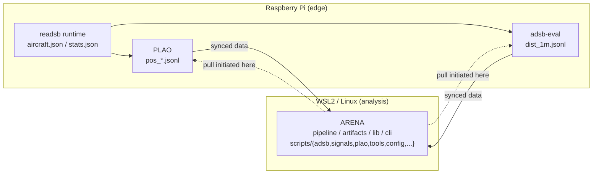

# ARENA System Context (Reference)

This document preserves the broader three-repository context and an execution-context reference.
The canonical public architecture document is `docs/architecture.md`.

## System Context

ARENA is the statistical evaluation layer in a telemetry stack.
It does not collect raw telemetry on edge devices.

Current edge-side flow (operational view):

- `readsb` feeds both `PLAO` and `adsb-eval` in parallel (not a PLAO -> adsb-eval chain)

Data is then synchronized/pulled into the analysis side where ARENA runs.
Operationally, pull/rsync is initiated from the ARENA side.

```text
Raspberry Pi (edge)                    WSL2 / Linux (analysis)
┌─────────────────────┐                ┌──────────────────────────┐
│  readsb runtime     │                │         ARENA            │
│  ├─ aircraft.json   │                │                          │
│  └─ stats.json      │                │  src/arena/              │
│                     │                │  ├─ pipeline/  wave+stage│
│  PLAO               │                │  ├─ artifacts/ verify    │
│  └─ pos_*.jsonl     │                │  ├─ lib/      config     │
│                     │                │  └─ cli.py    entry      │
│  adsb-eval          │                │                          │
│  └─ dist_1m.jsonl   │                │  scripts/{adsb,signals,  │
│                     │                │   plao,tools,config,...}  │
│  data flow edge->analysis            │                          │
│  PLAO outputs    ───────────────────>│  consumed by ARENA       │
│  adsb-eval outputs──────────────────>│  consumed by ARENA       │
└─────────────────────┘                └──────────────────────────┘

Control direction for transfer: ARENA side initiates pull/rsync.
```



Current `scripts/` groups in this repository:

- `scripts/adsb/`: aggregation, statistical evaluation, change-point, report, heatmap, and ops payloads
- `scripts/signals/`: signal aggregation/evaluation payloads
- `scripts/plao/`: PLAO distance-AUC payloads
- `scripts/tools/`: smoke reproducibility and artifact compatibility tools
- `scripts/config/`: default settings and phase templates

## Repository Roles

- [PLAO](https://github.com/yukimurata0421/plao-pos-collector) — per-aircraft position logging on the Pi
- [adsb-eval](https://github.com/yukimurata0421/adsb-eval) — edge-side distance/signal aggregation
- **ARENA** (this repository) — orchestration, evaluation, artifact control, and public reproducibility surface

## Execution Model Note (ARENA)

ARENA keeps logical stages in step definitions, but runtime execution is not a simple stage-by-stage serial flow:

- Stage 1 is executed with wave-based parallel scheduling (`STAGE1_WAVES`).
- Selected stages are executed with cross-stage parallel groups where allowed (`PARALLEL_STAGE_GROUPS`).
- Early launch is used for independent stages (`EARLY_LAUNCH_STAGES`).
- Stage 3 is intentionally separated from the cross-stage parallel group because it consumes Stage 2 outputs.

For authoritative architecture boundaries, see `docs/architecture.md`.
For release evolution details from `v0.2.5` to `v0.2.9`, see `docs/evolution/v0.2.5-to-v0.2.9.md`.
